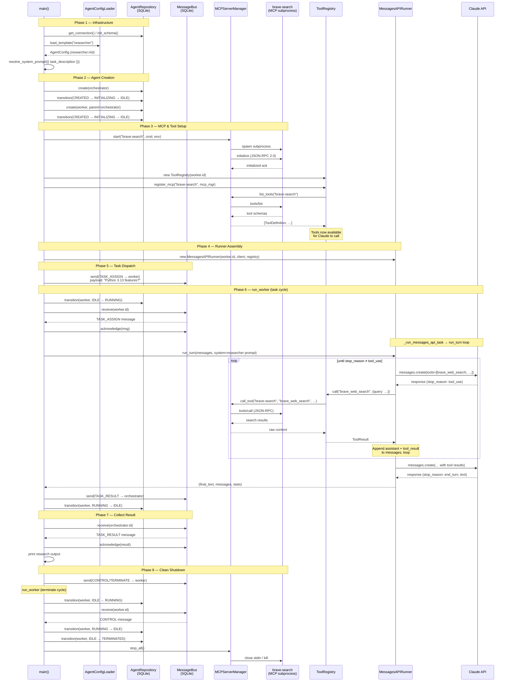

# agentmill

A Python framework for orchestrating clusters of Claude-powered agents. Agents communicate through a SQLite-backed message bus, persist all state to SQLite, and coordinate with humans via an IRC gateway. No external services are required beyond an Anthropic API key.

## Contents

- [Architecture](#architecture)
- [Quick start](#quick-start)
- [Project layout](#project-layout)
- [Core concepts](#core-concepts)
  - [Agent lifecycle](#agent-lifecycle)
  - [Message bus](#message-bus)
  - [Execution modes](#execution-modes)
  - [Tool use](#tool-use)
  - [MCP servers](#mcp-servers)
  - [Human-in-the-loop (IRC)](#human-in-the-loop-irc)
  - [Agent configuration files](#agent-configuration-files)
  - [Observability](#observability)
- [Examples](#examples)
  - [Native tool example](#native-tool-example)
  - [Template-driven research task](#template-driven-research-task)
  - [Multiple tasks](#multiple-tasks)
  - [Claude Code worker](#claude-code-worker)
  - [Human approval gate](#human-approval-gate)
- [Configuration reference](#configuration-reference)
- [Docker deployment](#docker-deployment)
- [Development](#development)

---

## Architecture

```
┌─────────────────────────────────────────────────────────┐
│                      Orchestrator                        │
│   (AgentRole.ORCHESTRATOR, execution_mode: messages_api) │
└──────────────┬─────────────────────────┬────────────────┘
               │ TASK_ASSIGN             │ TASK_ASSIGN
               ▼                         ▼
┌──────────────────────┐    ┌──────────────────────────┐
│    Worker A          │    │    Worker B               │
│  messages_api mode   │    │  claude_code mode         │
│  (reasoning, summary)│    │  (code gen, file edits)   │
└──────────────────────┘    └──────────────────────────┘
               │                         │
               └──────────┬──────────────┘
                          │ TASK_RESULT / TASK_ERROR
                          ▼
                    SQLite message bus
                    (all coordination)
```

**Hybrid topology** — orchestrators can themselves be workers under a parent orchestrator. All state lives in a single SQLite file (`agent_orchestrator.db`). There are no message queues, brokers, or shared memory: every agent interaction goes through the bus.

---

## Quick start

### Prerequisites

- Docker and Docker Compose
- An Anthropic API key
- An IRC server reachable on port 6667 (for the human-in-the-loop gateway; optional for headless use)

### 1. Clone and configure

```bash
git clone <repo-url> agentmill
cd agentmill
cp .env.example .env
```

Edit `.env` and set at minimum:

```bash
ANTHROPIC_API_KEY=sk-ant-...
IRC_HOST=127.0.0.1   # address of your IRC server
```

### 2. Build and start

```bash
docker compose build
docker compose up
```

The container starts with all framework modules loaded. Add your entry point (see [Examples](#examples)) and mount it or bake it into the image.

### 3. Run without Docker

```bash
python -m venv .venv
source .venv/bin/activate
pip install -e ".[dev]"
export ANTHROPIC_API_KEY=sk-ant-...
python my_orchestrator.py
```

---

## Project layout

```
agentmill/
├── orchestrator/
│   ├── agent.py          # Agent dataclass, AgentState FSM, AgentRepository
│   ├── bus.py            # MessageBus — SQLite-backed async message passing
│   ├── config.py         # AgentConfigLoader, resolve_system_prompt
│   ├── db.py             # SQLite connection pool, schema migrations
│   ├── irc_gateway.py    # IRCGateway, TrustedNickRegistry, InteractionRequest
│   ├── mcp.py            # MCPServerManager — MCP server subprocess lifecycle
│   ├── registry.py       # ToolRegistry, @tool decorator, ToolResult
│   ├── runner.py         # ClaudeCodeRunner, MessagesAPIRunner, run_worker
│   └── telemetry.py      # OTel tracing, ConsoleFormatter
├── agents/
│   ├── templates/        # Committed: human-authored agent definitions (.md)
│   └── instances/        # Runtime: orchestrator-generated per-agent configs
├── tests/
├── specs/                # Architectural decision records
├── mcp_servers.json      # MCP server registry
├── irc_config.yaml       # IRC connection + trusted nicks
├── Dockerfile
├── docker-compose.yml
└── .env.example
```

---

## Core concepts

### Agent lifecycle

Every agent is a finite state machine. The only way to change an agent's state is through `AgentRepository.transition()` — it validates the transition, writes to the DB, and emits an OTel span event.

```
CREATED → INITIALIZING → IDLE → RUNNING → IDLE
                       ↘               ↘ SUSPENDED → IDLE
                        FAILED → TERMINATED
```

```python
from orchestrator.db import get_connection, init_schema
from orchestrator.agent import Agent, AgentRole, AgentState, AgentRepository

conn = get_connection()          # shared connection, WAL mode
init_schema(conn)                # idempotent: creates tables if absent

repo = AgentRepository(conn)

agent = Agent(
    role=AgentRole.WORKER,
    cluster_id="cluster-1",
    context={"execution_mode": "messages_api", "task_description": "..."},
)
repo.create(agent)
repo.transition(agent.id, AgentState.INITIALIZING)
repo.transition(agent.id, AgentState.IDLE)
```

Invalid transitions raise `InvalidStateTransitionError` immediately — they are never silently ignored.

---

### Message bus

Agents never share memory. All coordination goes through `MessageBus`.

```python
from orchestrator.bus import Message, MessageBus, MessageType

bus = MessageBus(conn)

# Send a task to a worker
await bus.send(Message(
    type=MessageType.TASK_ASSIGN,
    sender_id=orchestrator.id,
    recipient_id=worker.id,
    cluster_id="cluster-1",
    payload={
        "task_id": "t-001",
        "description": "Summarise the Q3 earnings report",
    },
))

# Receive (polls DB, returns None on timeout)
msg = await bus.receive(worker.id, timeout=30.0)
if msg:
    await bus.acknowledge(msg.id)   # mark DELIVERED

# Broadcast to every agent in a cluster
await bus.broadcast("cluster-1", Message(
    type=MessageType.CONTROL,
    sender_id=orchestrator.id,
    cluster_id="cluster-1",
    payload={"command": "TERMINATE", "reason": "task complete"},
))
```

Messages are durable — a process crash before `acknowledge()` leaves the message `PENDING` for redelivery. The bus applies backpressure (blocks `send()` when a recipient has ≥ 50 unacknowledged messages).

---

### Execution modes

Each agent has a `context.execution_mode` that determines how it runs tasks:

| Mode | Class | Use for |
|---|---|---|
| `messages_api` | `MessagesAPIRunner` | Reasoning, planning, summarisation, tool use |
| `claude_code` | `ClaudeCodeRunner` | Code generation, file editing, shell commands |

`run_worker` dispatches automatically:

```python
from orchestrator.runner import (
    ClaudeCodeRunner, MessagesAPIRunner, run_worker
)
from orchestrator.telemetry import init_tracing, get_logger
from opentelemetry import trace

init_tracing("my_service")
tracer = trace.get_tracer("my_service")
logger = get_logger("agent/" + worker.id)

import anthropic
client = anthropic.AsyncAnthropic()

api_runner = MessagesAPIRunner(
    agent_id=worker.id,
    client=client,
    registry=registry,     # ToolRegistry for this agent
    tracer=tracer,
    logger=logger,
)

cc_runner = ClaudeCodeRunner(
    agent_id=worker.id,
    tracer=tracer,
    logger=logger,
)

# Handle one task cycle. Call in a loop for multi-task workers.
await run_worker(
    worker, bus, repo, tracer, logger,
    api_runner=api_runner,
    cc_runner=cc_runner,
    receive_timeout=30.0,
)
```

`run_worker` handles the full cycle: `IDLE → RUNNING → (IDLE | FAILED | TERMINATED)`, sends `TASK_RESULT` or `TASK_ERROR` back to the parent, and guarantees a `FAILED` transition on any unhandled exception.

---

### Tool use

Native Python tools are registered with `@tool` and added to a `ToolRegistry`. The registry is passed to `MessagesAPIRunner`, which calls tools automatically during the messages API loop.

```python
from orchestrator.registry import ToolRegistry, tool

@tool(
    name="read_file",
    description="Read the contents of a file.",
    schema={
        "type": "object",
        "properties": {
            "path": {"type": "string", "description": "Absolute file path"},
        },
        "required": ["path"],
    },
)
async def read_file(input: dict) -> str:
    with open(input["path"]) as f:
        return f.read()


registry = ToolRegistry(agent_id=worker.id, tool_timeout_seconds=30.0)
registry.register_native(read_file._tool_meta)
```

Tool errors are returned to Claude as `is_error: true` — Claude decides whether to retry. `ToolNotFoundError` and budget exhaustion (`BudgetExceededError`) propagate as hard exceptions.

Budget limits are set in the agent's context:

```python
context = {
    "execution_mode": "messages_api",
    "max_tool_calls": 20,       # default 50
    "max_iterations": 10,       # default 20 (Claude turns)
}
```

---

### MCP servers

MCP servers are defined in `mcp_servers.json` at the project root and run as subprocesses using stdio transport.

```json
{
  "filesystem": {
    "command": ["npx", "-y", "@modelcontextprotocol/server-filesystem"],
    "args": ["/workspace"],
    "env": {}
  },
  "brave-search": {
    "command": ["npx", "-y", "@modelcontextprotocol/server-brave-search"],
    "args": [],
    "env": {"BRAVE_API_KEY": "${BRAVE_API_KEY}"}
  }
}
```

`${VAR}` references are resolved from environment variables at startup. A missing required variable raises `MCPStartupError` and transitions the agent to `FAILED`.

```python
from orchestrator.mcp import MCPServerManager, load_mcp_registry
from orchestrator.registry import ToolRegistry

registry = load_mcp_registry("mcp_servers.json")

mgr = MCPServerManager()
await mgr.start("filesystem", command=registry["filesystem"]["command"])

tool_registry = ToolRegistry(agent_id=worker.id)
await tool_registry.register_mcp("filesystem", mgr)

# tool_registry now includes all tools advertised by the filesystem server
print(tool_registry.list_definitions())

await mgr.stop_all()
```

---

### Human-in-the-loop (IRC)

When an agent needs human input it suspends itself, posts a request to IRC, and waits. A trusted nick responds with a structured command; the gateway fires an event and the agent resumes.

**`irc_config.yaml`** defines the server and trusted nicks:

```yaml
server:
  host: "127.0.0.1"
  port: 6667

bot:
  nick: "orchestrator"
  channel: "#agents"

trusted_nicks:
  owner:
    - "mike"
  delegate:
    - "alice"
```

**IRC commands** accepted from trusted nicks:

| Command | Who | Effect |
|---|---|---|
| `!approve <id>` | owner, delegate | Resume agent with approval |
| `!deny <id> [reason]` | owner, delegate | Resume agent with denial |
| `!direct <id> <instruction>` | owner, delegate | Inject freeform instruction |
| `!terminate <agent_id>` | owner only | Terminate the agent |

**Usage in an agent:**

```python
from orchestrator.irc_gateway import (
    IRCGateway, TrustedNickRegistry,
    InteractionRequest, RequestType,
)
import yaml

config = yaml.safe_load(open("irc_config.yaml"))
registry = TrustedNickRegistry(config)
gateway = IRCGateway(config, registry, tracer, logger, conn)

# Start the receive loop as a background task
gateway_task = asyncio.create_task(gateway.run())

# In the agent, before a destructive action:
repo.transition(agent.id, AgentState.SUSPENDED, reason="awaiting approval")

response = await gateway.post_interaction(InteractionRequest(
    agent_id=agent.id,
    request_type=RequestType.APPROVAL,
    prompt="Requesting permission to delete 3 files in /workspace/output.",
))

repo.transition(agent.id, AgentState.IDLE, reason=f"human:{response.response_type}")

if response.response_type == "APPROVE":
    # proceed
    ...
elif response.response_type == "DENY":
    reason = response.payload.get("reason", "no reason given")
    # abandon action, feed reason back to Claude
    ...
elif response.response_type == "DIRECT":
    instruction = response.payload.get("instruction", "")
    # inject instruction as next user turn
    ...
```

The gateway waits indefinitely — the agent stays `SUSPENDED` until a human responds. There is no timeout.

---

### Agent configuration files

Agent types are defined as Markdown files with YAML frontmatter in `agents/templates/`. The Markdown body is the system prompt.

**`agents/templates/researcher.md`:**

```markdown
---
name: researcher
version: 1.0.0
role: worker
execution_mode: messages_api
description: "Searches the web and summarises findings."
tools:
  native: []
  mcp: ["brave-search"]
limits:
  max_iterations: 15
  max_tool_calls: 30
allowed_paths: []
required_env: ["BRAVE_API_KEY"]
tags: ["research", "search"]
---

You are a research assistant. Your job is to answer questions by searching
the web and summarising your findings concisely.

Current task: {{ task_description }}
```

**Loading and instantiating:**

```python
from orchestrator.config import AgentConfigLoader, resolve_system_prompt

loader = AgentConfigLoader()
cfg = loader.load_template("researcher")

system_prompt = resolve_system_prompt(
    cfg.system_prompt,
    {"task_description": "What are the main features of Python 3.13?"},
)

agent = Agent(
    role=AgentRole.WORKER,
    cluster_id="cluster-1",
    context={
        "execution_mode": cfg.execution_mode,
        "system_prompt": system_prompt,
        "max_iterations": cfg.limits["max_iterations"],
        "max_tool_calls": cfg.limits["max_tool_calls"],
        "mcp_servers": cfg.tools_mcp,
    },
)
```

Templates are validated at framework startup. Any invalid template is a hard startup error:

```python
from orchestrator.config import validate_all_templates

validate_all_templates("agents/templates")  # raises StartupValidationError if any fail
```

---

### Observability

All spans follow the `<domain>.<operation>` naming convention (`agent.run`, `llm.call`, `tool.call`, `message.send`, `irc.interaction.wait`). Traces are written to `./traces/YYYY-MM-DD.jsonl` and optionally to an OTLP endpoint.

```python
from orchestrator.telemetry import init_tracing, get_logger
from opentelemetry import trace

tracer = init_tracing(
    service_name="my_orchestrator",
    otlp_endpoint="http://localhost:4318",   # optional
    traces_dir="./traces",
)
logger = get_logger("agent/" + agent.id)

logger.info("agent.started", extra={"cluster": agent.cluster_id})
```

Console output format:

```
[14:07:22] INFO     agent/3f2a   task assigned       task_id=t-001
[14:07:22] INFO     agent/3f2a   llm.call            iteration=1 stop_reason=tool_use
[14:07:22] DEBUG    agent/3f2a   tool.called         tool=read_file is_error=False duration_ms=12
[14:07:23] INFO     agent/3f2a   task complete       iterations_used=2 tool_calls_made=1
```

---

## Examples

### Native tool example

The simplest example — a `@tool`-decorated Python function wired directly into the `ToolRegistry`, no agent template or MCP server. See [`native_tool_example.py`](native_tool_example.py).

```python
from orchestrator.registry import ToolRegistry, tool
from orchestrator.runner import MessagesAPIRunner, run_worker

# Define a native tool
@tool(
    name="echo",
    description="Return the input string unchanged.",
    schema={
        "type": "object",
        "properties": {"text": {"type": "string"}},
        "required": ["text"],
    },
)
async def echo(input: dict) -> str:
    return input["text"]

# Register it and build the runner
registry = ToolRegistry(agent_id=worker.id)
registry.register_native(echo._tool_meta)

runner = MessagesAPIRunner(
    agent_id=worker.id,
    client=anthropic.AsyncAnthropic(),
    registry=registry,
    tracer=tracer,
    logger=logger,
)

# Send a task and run one cycle
await bus.send(Message(
    type=MessageType.TASK_ASSIGN,
    sender_id=orch.id,
    recipient_id=worker.id,
    cluster_id="demo",
    payload={"task_id": "t-001", "description": "Echo back: hello world"},
))
await run_worker(worker, bus, repo, tracer, logger, api_runner=runner)

result = await bus.receive(orch.id, timeout=5.0)
if result:
    print("Output:", result.payload["output"])
    await bus.acknowledge(result.id)
```

---

### Template-driven research task

`TaskRunner` handles all the plumbing — agent creation, MCP server lifecycle, tool registration, bus dispatch, result collection, and teardown. See [`research_agent_orchestrator.py`](research_agent_orchestrator.py).

```python
from orchestrator.task_runner import TaskRunner

TASK_DESCRIPTION = "What are the main features of Python 3.13?"

results = await TaskRunner(
    template_name="researcher",
    template_vars={"task_description": TASK_DESCRIPTION},
    task_descriptions=[TASK_DESCRIPTION],
).run()

if results[0]:
    print(results[0])
```

---

### Multiple tasks

Pass multiple descriptions to `TaskRunner` and the worker processes them sequentially, reusing the same MCP connections throughout. See [`multiple_task_orchestrator.py`](multiple_task_orchestrator.py).

```python
from orchestrator.task_runner import TaskRunner

TASK_DESCRIPTIONS = [
    "What are the main features of Python 3.13?",
    "What are the key differences between Rust and Go for backend development?",
]

results = await TaskRunner(
    template_name="researcher",
    template_vars={"task_description": "Answer research questions"},
    task_descriptions=TASK_DESCRIPTIONS,
).run()

for idx, (description, output) in enumerate(zip(TASK_DESCRIPTIONS, results), start=1):
    print(f"\n--- Result {idx}: {description} ---")
    print(output if output else "(no result)")
```

---

### Claude Code worker

Use `execution_mode: "claude_code"` for tasks that involve writing or editing files. The `ClaudeCodeRunner` invokes `claude --print` as a subprocess (or the Claude Code SDK if installed).

```python
from orchestrator.runner import ClaudeCodeRunner

cc_worker = Agent(
    role=AgentRole.WORKER,
    cluster_id="dev-cluster",
    parent_id=orch.id,
    context={
        "execution_mode": "claude_code",
        "working_directory": "/workspace/myproject",
        "allowed_paths": ["/workspace/myproject"],
        "max_iterations": 10,        # maps to --max-turns
        "task_timeout_seconds": 300.0,
    },
)
repo.create(cc_worker)
repo.transition(cc_worker.id, AgentState.INITIALIZING)
repo.transition(cc_worker.id, AgentState.IDLE)

await bus.send(Message(
    type=MessageType.TASK_ASSIGN,
    sender_id=orch.id,
    recipient_id=cc_worker.id,
    cluster_id="dev-cluster",
    payload={
        "task_id": "cc-001",
        "description": "Add type annotations to all functions in src/utils.py",
    },
))

cc_runner = ClaudeCodeRunner(
    agent_id=cc_worker.id,
    tracer=tracer,
    logger=get_logger("agent/" + cc_worker.id),
)

await run_worker(
    cc_worker, bus, repo, tracer, logger,
    cc_runner=cc_runner,
    receive_timeout=10.0,
)

result = await bus.receive(orch.id, timeout=30.0)
if result and result.type == MessageType.TASK_RESULT:
    print("Files modified:", result.payload.get("files_modified"))
```

Before spawning a `claude_code` worker, write a `CLAUDE.md` into the working directory to give the session context:

```python
from pathlib import Path

claude_md = Path("/workspace/myproject/CLAUDE.md")
claude_md.write_text(f"""
# Task context (generated by orchestrator)

## Task
{task_description}

## Constraints
- Only modify files under: /workspace/myproject/src
- Do not install new packages
- Write tests for any new functions
""")
```

---

### Human approval gate

```python
import yaml
from orchestrator.irc_gateway import (
    IRCGateway, TrustedNickRegistry,
    InteractionRequest, RequestType,
)

config = yaml.safe_load(open("irc_config.yaml"))
registry = TrustedNickRegistry(config)
gateway = IRCGateway(config, registry, tracer, logger, conn)
gateway_task = asyncio.create_task(gateway.run())

try:
    async def guarded_delete(agent, files: list[str]):
        # Suspend before destructive action
        repo.transition(agent.id, AgentState.SUSPENDED, reason="awaiting approval")

        response = await gateway.post_interaction(InteractionRequest(
            agent_id=agent.id,
            request_type=RequestType.APPROVAL,
            prompt=f"Requesting permission to delete {len(files)} files: {', '.join(files)}",
        ))

        repo.transition(agent.id, AgentState.IDLE, reason=f"human:{response.response_type}")

        if response.response_type == "APPROVE":
            for f in files:
                os.remove(f)
            return True
        else:
            print("Denied:", response.payload.get("reason"))
            return False

    # The agent pauses here until mike types !approve <id> in #agents
    await guarded_delete(worker, ["/tmp/old_report.txt"])

finally:
    await gateway.disconnect()
    gateway_task.cancel()
```

---

## Configuration reference

### Environment variables

| Variable | Default | Required | Purpose |
|---|---|---|---|
| `ANTHROPIC_API_KEY` | — | Yes | Anthropic API access |
| `DB_PATH` | `./agent_orchestrator.db` | No | SQLite file path |
| `IRC_HOST` | `127.0.0.1` | No | IRC server host |
| `IRC_PORT` | `6667` | No | IRC server port |
| `IRC_NICK` | `orchestrator` | No | Bot nick on IRC |
| `IRC_CHANNEL` | `#agents` | No | Human interaction channel |
| `LOG_LEVEL` | `INFO` | No | Console log level |
| `OTLP_ENDPOINT` | — | No | Remote OTel collector URL |

### `irc_config.yaml`

```yaml
server:
  host: "127.0.0.1"
  port: 6667

bot:
  nick: "orchestrator"
  channel: "#agents"

trusted_nicks:
  owner:
    - "your_nick"    # can approve, deny, direct, terminate
  delegate:
    - "colleague"    # can approve, deny, direct — cannot terminate

timeouts:
  interaction_wait_seconds: null   # null = wait indefinitely
```

### `mcp_servers.json`

```json
{
  "filesystem": {
    "command": ["npx", "-y", "@modelcontextprotocol/server-filesystem"],
    "args": ["/allowed/path"],
    "env": {}
  },
  "brave-search": {
    "command": ["npx", "-y", "@modelcontextprotocol/server-brave-search"],
    "args": [],
    "env": {"BRAVE_API_KEY": "${BRAVE_API_KEY}"}
  }
}
```

### Agent template frontmatter

```yaml
name: my_agent           # used in AgentConfigLoader.load_template("my_agent")
version: 1.0.0           # semver — bump MINOR for tool changes, MAJOR for role changes
role: worker             # "worker" | "orchestrator"
execution_mode: messages_api   # "messages_api" | "claude_code"
description: "Short description shown in logs."
tools:
  native: ["read_file"]  # names of @tool-decorated functions to enable
  mcp: ["filesystem"]    # names from mcp_servers.json
limits:
  max_iterations: 20
  max_tool_calls: 50
  tool_timeout_seconds: 30.0
  session_timeout_seconds: 300.0
allowed_paths:
  - "/workspace"
required_env:            # startup will fail if these are absent
  - "SOME_API_KEY"
tags: ["research"]
```

---

## Docker deployment

```bash
# First-time setup
cp .env.example .env
# Edit .env with your ANTHROPIC_API_KEY and IRC_HOST

# Build the image (Node.js 22 + claude CLI + uv + Python package)
docker compose build

# Start
docker compose up -d

# Stream logs
docker compose logs -f

# Open a shell
docker compose exec agentmill bash

# Stop and remove containers (volumes are preserved)
docker compose down

# Remove volumes too (deletes DB and traces)
docker compose down -v
```

### Volumes

| Volume | Mount | Contents |
|---|---|---|
| `agentmill_data` | `/data` | `agent_orchestrator.db` and `traces/YYYY-MM-DD.jsonl` |
| `agentmill_instances` | `/app/agents/instances` | Runtime agent instance configs |
| `agentmill_uv_cache` | `/root/.cache/uv` | Cached MCP server packages |

Config files (`mcp_servers.json`, `irc_config.yaml`, `agents/templates/`) are bind-mounted from the host — edit them and restart the container without rebuilding:

```bash
docker compose restart agentmill
```

---

## Development

```bash
# Install with dev dependencies
pip install -e ".[dev]"

# Run tests
python -m pytest

# Run tests with verbose output
python -m pytest -v

# Run a specific test class
python -m pytest tests/test_runner.py::TestMessagesAPIRunner -v

# Live IRC integration tests (requires IRC server and human at nick 'mike')
python tests/test_irc_live.py
```

### Specs

Architectural decisions are documented in `specs/`. Read the relevant spec before implementing any feature:

| Spec | Domain |
|---|---|
| `spec-agent-lifecycle.md` | Agent FSM, state persistence |
| `spec-inter-agent-communication.md` | Message bus, delivery guarantees |
| `spec-human-irc-gateway.md` | IRC gateway, trusted nicks, interaction lifecycle |
| `spec-tool-mcp-integration.md` | Native tools, MCP servers, tool loop |
| `spec-claude-code-sdk.md` | ClaudeCodeRunner, worker integration |
| `spec-agent-configuration.md` | Config file format, templates, instances |
| `spec-observability.md` | OTel tracing, console logging |


## Architecture Example



